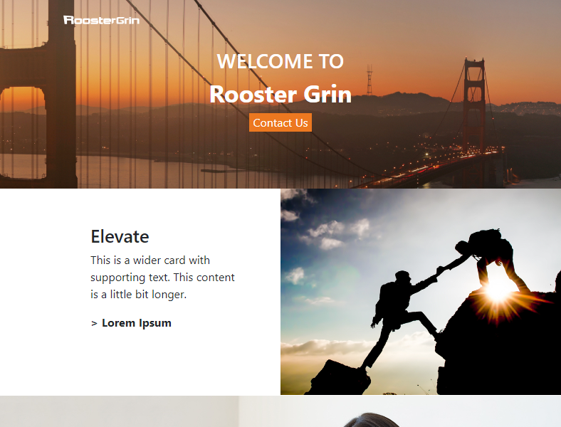

# Rooster Grin Evaluation

- [Overview](#overview)
  - [Screenshot](#screenshot)
  - [Links](#links)
- [My process](#my-process)
  - [Built with](#built-with)
  - [What I learned](#what-i-learned)
  - [Continued development](#continued-development)
  - [Useful resources](#useful-resources)
- [Author](#author)
- [Acknowledgments](#acknowledgments)

## Overview
- The goal of this project is to create a client website that has some key features requested by the client (i.e. Rooster Grin as the client).

### Screenshot

### Links
- Solution URL:
 https://github.com/Dev-Wy/Rooster-Grin-Evaluation/
- Live Site URL:
 https://dev-wy.github.io/Rooster-Grin-Evaluation/
## My Process
### Built with
- HTML
- CSS
- Bootstrap5
- JavaScript

### What I learned
- I had not had previous experience with animations or transitions. I learned a great deal. 
- I also learned how to blend Bootstrap into my CSS rather than coding the majority with it. 
- I enjoyed tinkering with the carousal section which was also new to me.

### Continued development
- I would like to learn more about the hover transition and timing for animations. I will enjoy tinkering on this project in the future.
- I would also like to learn how to outline text. This was something I attempted but in the end decided to forgo for other aspects of the projects.

### Useful Resources: 
- Font Awesome: https://fontawesome.com/
- Rooster Grin: https://www.roostergrin.com/

## Author
- Jake Wyant
- Portfolio: https://dev-wy.github.io/Portfolio/
- LinkedIn: https://www.linkedin.com/in/jakewyantdeveloper/
## Acknowledgments
- Thank you to Rooster Grin for allowing me the opportunity to take your Evaluation and practice my coding skills.
- Special thanks to Skillcrush for giving me the foundation to build on.

